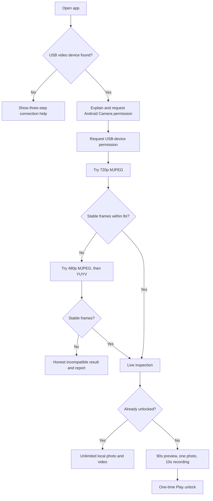

# Product workflow

## State-to-screen contract

| State | What the user sees | Primary action | Never do |
|---|---|---|---|
| No device | Cable-first connection instructions | Connect camera | Show payment |
| Camera permission denied | Why Android requires it; phone cameras are not opened | Allow / open Settings | Claim USB works without permission |
| USB permission denied | Android owns this prompt | Try again | Invent a technical failure |
| Testing | Current safe profile and attempt number | Wait | Make the user pick codecs |
| Stable frame | Full-screen feed and core controls | Inspect/capture | Interrupt before proving compatibility |
| Trial expired | “It works on this phone” and localized one-time price | Unlock / restore | Subscription, countdown pressure, fake discount |
| Incompatible | Profiles tried, power/OTG advice, sanitized report | Retry / share report | Charge the user |
| Unplugged | Direct reconnect message | Reconnect | Crash or leave a frozen “live” frame |

## Supported camera count

The engine can enumerate multiple Android USB video devices, but v1 opens exactly one at a time for stability, power, and thermal control. The UI offers Lens only when more than one device is genuinely exposed. A dual-lens endoscope that switches internally through a proprietary cable command still appears as one device and must use its physical cable button.
